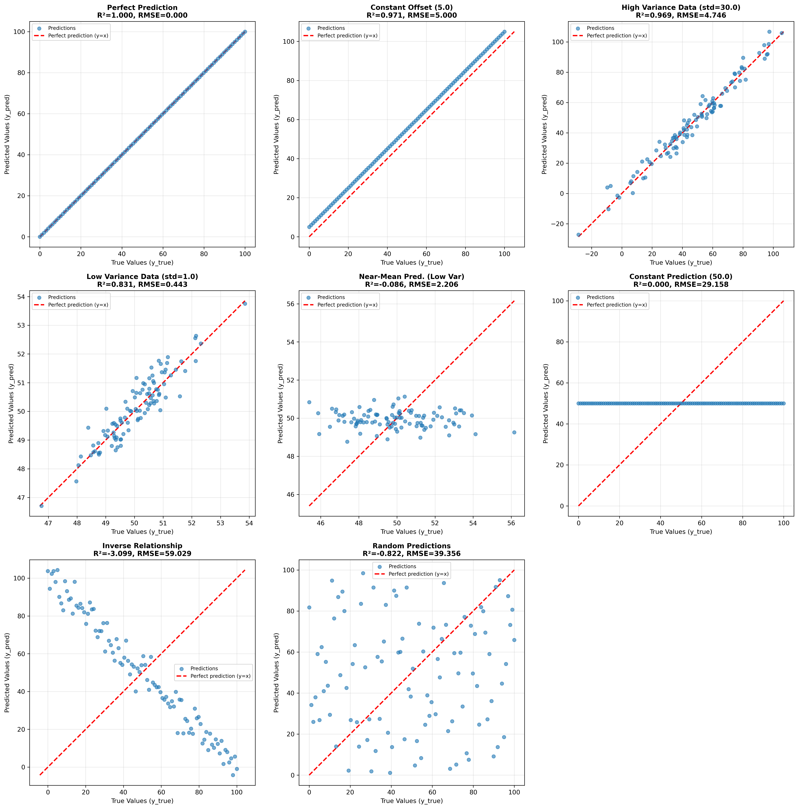
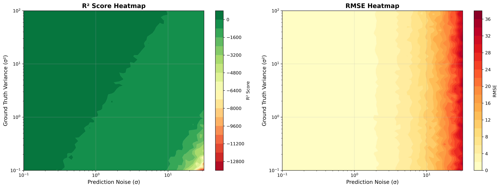
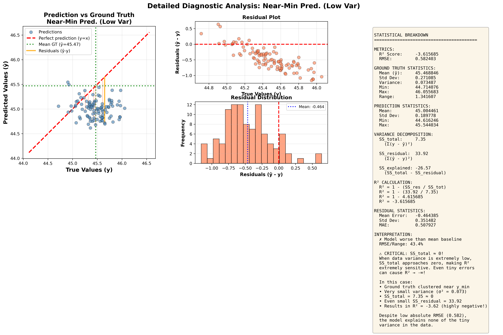
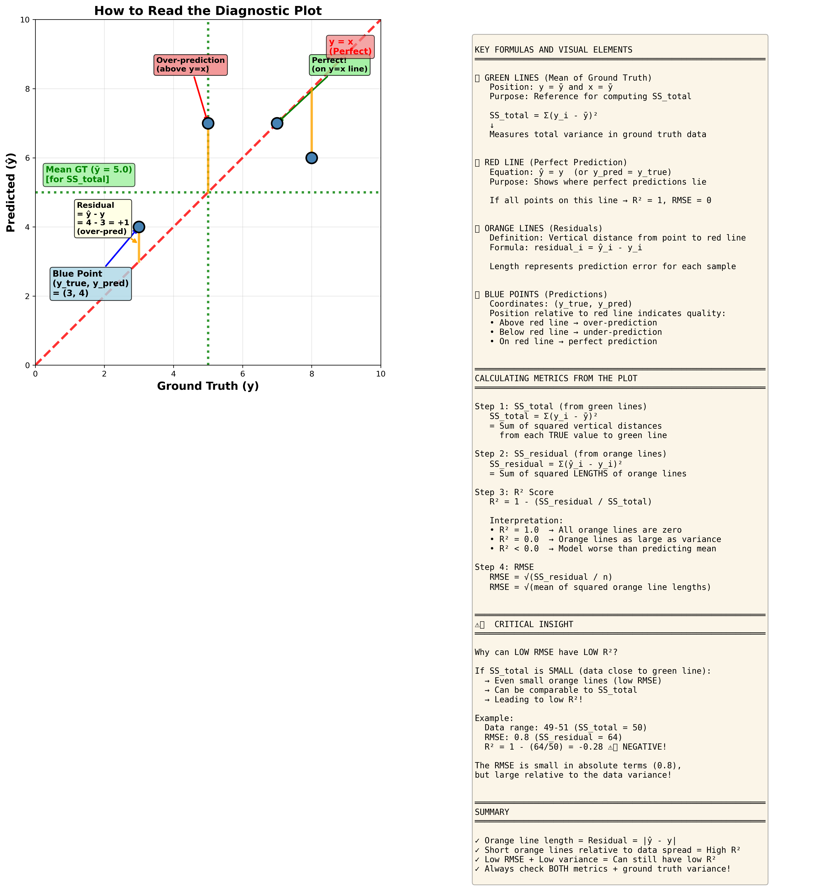

# R² Score and RMSE Synergy Investigation

## Purpose

This tool investigates the relationship between R² (R-squared) score and RMSE (Root Mean Square Error) metrics for regression tasks. Specifically, it answers the question:

**"Does low RMSE always imply high R² score, or can we have low RMSE with low or even negative R² score?"**

## Key Findings

### Answer: YES, low RMSE can coexist with low R²!

The critical factor is **ground truth variance**:

- **High variance data**: Low RMSE typically implies high R²
- **Low variance data**: Low RMSE can coexist with low R² (or even negative R²)

### Why This Happens

- **RMSE** is scale-dependent: measures absolute prediction error
  - RMSE = 2.0 on data ranging 0-100 → excellent (2% of range)
  - RMSE = 2.0 on data ranging 50-52 → poor (as large as the entire variance)

- **R²** is scale-independent: measures proportion of variance explained
  - R² = 1 - (SS_residual / SS_total)
  - SS_total = variance of ground truth
  - Small SS_total → R² can be low even with small SS_residual

## Usage

```bash
python investigate_r_score_rmse_synergy.py
```

## Requirements

```bash
pip install numpy matplotlib scikit-learn seaborn pandas
```

## Outputs

The script generates organized outputs in three separate directories:

### 📊 `metric_synergy_visualizations/`

#### 1. Scenario Comparison Plot
**File**: `scenario_comparison_r2_vs_rmse.png`



Overview scatter plots showing 9 different scenarios with Mean GT reference lines (green dotted):
- Perfect prediction
- Constant offset
- High/low variance data
- Near-mean and near-minimum predictions on low variance data
- Inverse relationships
- Random predictions

#### 2. Variance-Noise Impact Heatmap
**File**: `variance_noise_impact_heatmap.png`



Reveals the critical relationship:
- **Left (R² Heatmap)**: Shows R² depends on BOTH variance and noise (diagonal pattern)
- **Right (RMSE Heatmap)**: Shows RMSE depends only on noise (horizontal bands)
- **Key Insight**: Same RMSE can yield vastly different R² depending on data variance

See [HEATMAP_INTERPRETATION.md](docs/HEATMAP_INTERPRETATION.md) for detailed explanation.

#### 3. Detailed Diagnostic Plots
**Files**: `detailed_diagnostic_*.png` (5 plots for key scenarios)

Example: Near-Minimum Prediction (Low Variance) - demonstrating SS_total → 0 and R² → -∞



Each diagnostic plot includes:
- **Left panel**: Scatter plot with:
  - Mean GT lines (green dotted) - reference for SS_total
  - Perfect prediction line (y=x, red dashed)
  - Residuals (orange vertical lines) - show prediction errors
  - SS_total components (purple horizontal lines) - show deviation from mean
- **Top-right**: Residual plot (residuals vs true values)
- **Bottom-right**: Residual histogram (distribution of errors)
- **Right panel**: Statistical breakdown with complete variance decomposition

#### 4. Visual Guide
**File**: `visual_guide_annotated.png`



Educational diagram explaining how to read the diagnostic plots with annotated examples.

### 📋 `metric_synergy_analysis_tables/`

**scenarios_summary_metrics.csv**: Summary table with all scenarios and their metrics

### 📄 `metric_synergy_reports/`

**detailed_analysis_report.txt**: Comprehensive text report with all insights and analysis

### 📚 `docs/`

Additional documentation:
- [HEATMAP_INTERPRETATION.md](docs/HEATMAP_INTERPRETATION.md) - Detailed explanation of variance-noise heatmap
- [NEAR_MIN_SCENARIO_EXPLANATION.md](docs/NEAR_MIN_SCENARIO_EXPLANATION.md) - Edge case analysis
- [VISUAL_INTERPRETATION_GUIDE.md](docs/VISUAL_INTERPRETATION_GUIDE.md) - How to read the plots
- [PACKAGE_SUMMARY.md](docs/PACKAGE_SUMMARY.md) - Package overview

## Terminology

- **Ground Truth Variance (σ²)**: Measure of spread in the **true values** (y_true)
  - Example: Building heights 10-100m have higher variance than 49-51m
  - Formula: `Var(y) = mean((y - ȳ)²)`

- **Prediction Noise (σ)**: Standard deviation of **prediction errors**
  - Represents model uncertainty/inaccuracy
  - Generated as: `y_pred = y_true + random_error(mean=0, std=σ)`
  - Independent of ground truth variance

## Scenarios Explored

1. **Perfect Prediction**: RMSE=0, R²=1
2. **Constant Offset**: Low RMSE, High R² (if high variance)
3. **High Variance Data**: Good model, low RMSE, high R²
4. **Low Variance Data**: Small errors but low R²
5. **Near-Mean Prediction (Low Var)**: **KEY CASE** - Low RMSE, Low R²
6. **Near-Min Prediction (Low Var)**: **EXTREME CASE** - Low RMSE, Highly Negative R² (SS_total → 0)
7. **Constant Prediction**: R²=0 (baseline)
8. **Inverse Relationship**: Negative R²
9. **Random Predictions**: Very poor performance

## Practical Implications

1. **Always report both metrics** - neither is sufficient alone
2. **Check ground truth variance** when interpreting RMSE
3. **Low RMSE ≠ good model** if R² is also low
4. **Negative R²** means model is worse than predicting the mean
5. For **low variance data**, R² becomes a more critical metric

## Visual Elements Explained

### Understanding the Detailed Diagnostic Plots

#### 1. Mean GT Lines (Green Dotted)
- **Horizontal and vertical lines at ȳ**: Shows the mean of ground truth values
- **Purpose**: Reference point for computing SS_total = Σ(y - ȳ)²
- **Interpretation**: All variance in ground truth data is measured relative to this line
- **Baseline**: If model predicts ȳ for all points → R² = 0

#### 2. Perfect Prediction Line (Red Dashed, y=x)
- **Equation**: y_pred = y_true
- **Purpose**: Represents perfect predictions where every point falls exactly on this line
- **Interpretation**: Distance from this line represents prediction error
- **Target**: All points should ideally lie on this line

#### 3. Residuals (Orange Vertical Lines)
- **Definition**: Vertical distance from a blue point to the red dashed line (y=x)
- **Formula**: Residual = ŷ - y (predicted minus true)
- **Direction**: 
  - Line goes **up** from red line → **over-prediction** (positive residual)
  - Line goes **down** to red line → **under-prediction** (negative residual)
- **Relation to SS_residual**: Sum of squared orange line lengths = SS_residual
- **Relation to RMSE**: RMSE = √(mean of squared orange line lengths)

#### 4. SS_total Components (Purple Horizontal Lines)
- **Definition**: Horizontal distance from a blue point to the green vertical line at ȳ
- **Formula**: Deviation = y - ȳ (true value minus mean)
- **Purpose**: Shows how far each true value is from the mean
- **Relation to SS_total**: Sum of squared purple line lengths = SS_total
- **Key insight**: When these are very short (low variance), SS_total ≈ 0, making R² very sensitive

#### 5. Blue Points (Predictions)
- **Coordinates**: (y_true, y_pred)
- **Orange line length**: The residual (contribution to SS_residual and RMSE)
- **Purple line length**: Deviation from mean (contribution to SS_total)

#### Visual Relationship
- **SS_total** (purple lines) = variance in ground truth around mean ȳ
- **SS_residual** (orange lines) = variance in predictions around true values
- **R² = 1 - (SS_residual / SS_total)** = 1 - (orange² / purple²)
- When purple lines are very short → SS_total ≈ 0 → R² can be highly negative even with short orange lines!

## Mathematical Background

### R² Score
$$R^2 = 1 - \frac{\sum_{i=1}^{n}(y_i - \hat{y}_i)^2}{\sum_{i=1}^{n}(y_i - \bar{y})^2} = 1 - \frac{SS_{res}}{SS_{tot}}$$

- Range: (-∞, 1], where 1 is perfect
- R² = 0 means predicting the mean
- R² < 0 means worse than predicting the mean

### RMSE
$$RMSE = \sqrt{\frac{1}{n}\sum_{i=1}^{n}(y_i - \hat{y}_i)^2}$$

- Range: [0, ∞), where 0 is perfect
- Same units as the target variable
- Sensitive to outliers

## Example Use Cases

### Case 1: Building Height Estimation (High Variance)
- Heights range: 0-100m (variance: ~833 m²)
- RMSE: 5m
- R²: 0.97
- **Interpretation**: Excellent model ✓

### Case 2: Rooftop Height Estimation (Low Variance)
- Heights range: 48-52m (variance: ~1.3 m²)
- RMSE: 0.8m
- R²: 0.50
- **Interpretation**: Low RMSE but poor variance explanation ⚠

## Recommendations

For building height estimation tasks:

1. Report both RMSE and R² in your results
2. Include ground truth statistics (mean, std, range)
3. If dataset has mixed variance (e.g., low-rise and high-rise buildings), consider stratified evaluation
4. Use R² to understand if model captures the variability in data
5. Use RMSE to understand absolute error magnitude

## Author

Research Team - Building Height Estimation Project
Date: November 2025
